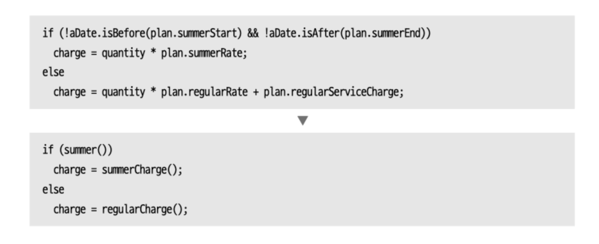

# 조건부 로직 간소화
프로그램을 복잡하게 만들 수도 있는 조건부 로직을 리팩터링해야한다.

## 1. 조건문 분해하기

조건식과 그 조건식에 딸린 조건절 각각을 함수로 추출한다.

## 2. 조건식 통합하기
조건은 똑같더라도 그 결과로 수행하는 동작이 같다면 통합하면 좋다. 그러나 독립된 검사일 경우 통합하면 안된다.

## 3. 중첩 조건문을 보호 구문으로 바꾸기
반환점이 하나일 때보다 의도를 부각하기 위해 보호구문으로 바꾸는 편이 좋다.

## 4. 조건부 로직 다형성으로 바꾸기
조건 로직을 클래스와 다형성으로 바꾼다.