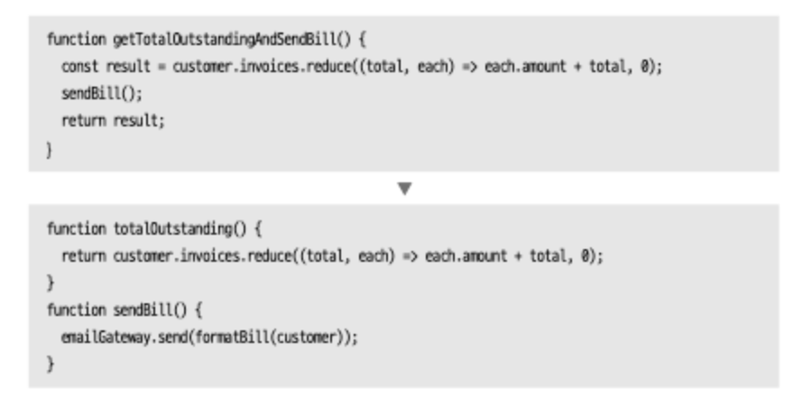

## API 리팩터링
모듈과 함수가 소프트웨어 블록이라면, 이 블록을 끼워 맞추는 연결부는 api다. 
좋은 api는 데이터를 갱신하는 함수와 조회를 하는 함수를 명확히 구분한다. 

두 기능이 섞이면 분리해야한다. 

만약 필요 이상으로 분해된다면 객체 통째로 넘기가를 해야한다. 

### 1. 질의 함수와 변경 함수 분리하기

외부에서 관찰할 수 있는 겉보기 부수효과가 없어야한다. (멱등하게)

겉보기라고 명명한 이유는, 캐시 때문이다. 안에서는 성능 개선이 있어야한다.

1. 대상 함수를 복제하고 질의 목적에 충실한 이름을 짓는다. 
2. 새 질의 함수에서 부수효과를 모두 제거한다.
3. 정적 검사 수행한다.
4. 원 함수를 호출하는 곳을 모두 찾아낸다. 질의하는 함수를 바뀐만큼 수정한다.
5. 원래 함수에서 질의 관련 코드를 제거한다.

### 2. 함수 매개변수화하기
두 함수의 로직이 아주 비슷하고 리터럴 값만 다르다면 그 다른 값만 매개변수로 받아 처리하는 함수 하나로 합쳐 중복을 없앨 수 있다. 

### 3. 플래그 인수 제거하기
플래그 인수란 호출되는 함수가 실행할 로직을 호출하는 쪽에서 선택하기 위해 전달하는 인수다. 
이는 호출할 수 있는 함수들이 무엇이고 어떻게 호출해야하는지를 이해하기가 어려워지는 단점이 있다. 

boolean 값으로 전달되는 것이 플래그 인수며, 이 불리언 값이 리터럴로 전달되게 되었을 때 뭘 의미하는지에 대한 의문이 생기게된다. 

### 4. 객체 통째로 넘기기
레코드를 통째로 넘기면 변화에 대응하기가 쉽다. 

함수가 레코드 자체에 의존하기를 원치 않을 때가 아니면 객체 안으로 로직을 집어넣어야한다. 

### 5. 매개 변수를 질의 함수로 바꾸기 
함수의 동작에 변화를 줄 수 있는 매개변수는 짧은 게 좋다. 
매개변수를 피호출 함수에서 알아낼 수 있는 경우에는 굳이 매개변수를 주지않는다. 

그러나 매개변수를 제거했을 때 피호출 함수에 원치않는 의존성이 생길 때는, 매개변수를 질의함수로 바꾸지 않는 것이 좋다. 

### 6. 질의 함수를 매개변수로 바꾸기
함수 안에 두기엔 거북한 참조들이 있다. 이럴 때는 매개변수로 해당 참조를 바꾸어 해결한다. 
이럴 때는 호출자가 복잡해질 수도 있다. 균형점을 잘 찾아야한다. 

## 7. 세터 제거하기
필드가 수정되지 않도록 한다. 아래와 같은 경우 세터 제거하기 리팩터링이 필요하다.
- 사람들이 무조건 접근자 메서드를 통해서만 필드를 다루려고 할 때 
- 생성자를 호출한 후 일련의 세터를 호출하여 객체를 완성하는 형태의 코드로 객체를 생성할 때 

## 8. 생성자를 팩터리 함수로 바꾸기
객체를 초기화하는 특별한 용도로 사용되는 생성자에는 이상한 제약이 따라붙기도 한다. 
가령 자바 생성자는 반드시 그 생성자를 정의한 클래스의 인스턴스를 반환해야한다. 
이름도 정할 수 없고 new와 같은 연산자도 써야한다. 

팩터리 함수에서는 이런 제약이 없다. 

## 9. 함수를 명령으로 바꾸기
함수를 그 함수만을 위한 객체 안으로 캡슐화하면 더 유용해질 때가 있는데, 이 객체를 가리켜 명령 객체나 명령이라 한다. 

보통 이 객체는 메서드 하나로 구성되며 이 메서드를 요청해 실행하는 것이 이 객체의 목적이다. 
- 훨씬 유연하게 함수를 제어하고 표현할 수 있다.
- 되돌리기 같은 보조 연산을 제공할 수 있다.
- 수명 주기를 더 정밀하게 제어하는 데 필요한 매개변수를 만들어주는 메서드도 제공할 수 있다.
- 상속과 훅을 이용해 사용자 맞춤형으로 만들 수도 있다.
- 일급 함수 기능을 흉내낼 수 있다.
- 중첩 함수를 지원하지 않는 언어에서도 메서드와 필드를 이용해 복잡한 함수를 잘게 쪼갤 수 있고, 이를 테스트와 디버깅에 활용할 수도 있다. 

그러나, 복잡성을 키우고 얻는 대가인 유연성임을 잊지 말아야한다.

## 10. 명령을 함수로 바꾸기
로직이 크게 복잡하지 않으면 명령을 함수로 그냥 바꾸는 것이 좋다. 

## 11. 수정된 값 반환하기
값 하나를 계산하는 함수에 유용한 방법. 내부에서 변수를 작성하고 반환한다.

## 12. 오류 코드를 예외로 바꾸기
코드에 throw new Error()

## 13. 예외를 사전 확인으로 바꾸기
예외가 과용되지 않도록 하여야한다. 만약 함수 수행 시 문제가 될 조건을 함수 호출 전에 검사할 수 있다면 그렇게 작업해야한다. 
예상치 못한 조건이 있을 때만 예외 처리로 응답한다. 

