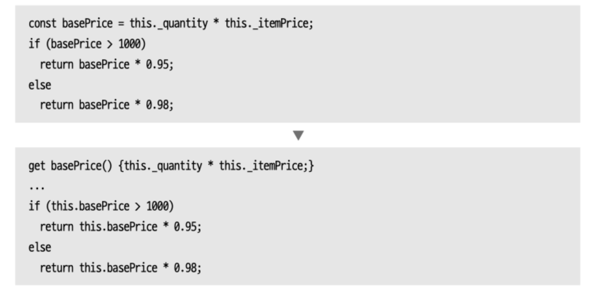

## 캡슐화하기
모듈을 분리할 때, 그 기준은 각 모듈이 다른 모듈에 드러내지 않아야할 변수나 메서드를 얼마나 잘 숨기느냐에 있다. 
레코드를 캡슐화하거나, 컬렉션을 캡슐화하는 것이 그 방법이다. 

### 1. 레코드 캡슐화하기
```javascript
organization = {name: 'a', country: 'GB'}
// 아래의 방식으로 캡슐화
class Organization {
    constructor(data){
        this._name = data.name;
        this._country = data.country
    }
    get name(){return this._name}
    set name(arg){this._name = arg}
    get country(){return this._country}
    set country(arg){this._country = arg}
}
```
이름을 바꾸거나 데이터가 바뀔 때, 객체를 사용하면 좋다. 내용을 조작하는 방식을 통제하기 쉬워진다.

1. 레코드를 담은 변수를 캡슐화한다.
2. 레코드를 감싼 단순한 클래스로 해당 변수의 내용을 교체한다.
3. 테스트한다.
4. 원본 레코드 대신 새로 정의한 클래스타입의 객체를 반환하는 함수들을 새로 만든다. 
5. 새함수를 사용하도록 예전함수에서 고친다.

### 2. 컬렉션 캡슐화하기
컬렉션 변수로의 접근을 캡슐화하면서 게터가 컬렉션 자체를 반환하도록 하게되면, 그 컬렉션을 감싼 클래스가 눈치채지 못하는 상태에서 컬렉션의 원소들이 바뀔 수 있다. 이럴 때는 컬렉션을 소유한 클래스를 통해서만 원소를 변경하도록 해야한다. 


게터를 제공하고 내부 컬렉션의 복제본을 반환하게하는 것이 가장 흔한 방식이다. 

### 3. 기본형을 객체로 바꾸기


개발 초기에는 단순한 정보를 숫자나 문자열같이 간단하게 표현하지만 점점 정보가 간단하지 않게 될 수 있다. 
단순한 출력 이상의 기능이 필요해지면 그 데이터를 표현하는 전용 클래스를 정의하는 것이 좋다. 

### 4. 임시 변수를 질의함수로 바꾸기
임시변수도 값의 의미를 설명할 수 있기에 유용하지만 아예 함수로 만들어 사용하는 편이 더 좋을 때가 많다. 


긴 함수의 한 부분을 별도 함수로 추출하고자 할 때, 변수들을 각각의 함수로 만들면 좋다. 추출한 함수에 변수를 따로 전달할 필요가 없어지기 때문이고, 또 추출한 함수와 원래 함수의 경계가 더 분명해지기도 한다. 

비슷한 계산을 수행하는 다른 함수에서도 사용할 수 있어 코드 중복이 줄어드는 효과가 있다.

이는 클래스 안에서 적용할 때 가장 좋다. 클래스는 추출할 메서드들에 공유 컨텍스트를 제공하기 때문이다. 

그런데 항상 좋은 것은 아니다. 변수에 값을 한번 대입한 뒤 더 복잡한 곳에서 여러번 다시 대입하면 바꾸기 좋지만 스냅샷 용도로 쓰이는 변수에는 이 리팩터링을 적용하면 안된다. 

### 5. 클래스 추출하기
클래스가 점점 비대해지는 경우가 많다. 클래스를 굳이 쪼갤 필요가 없다 생각하기 때문이다. 


메서드와 데이터가 너무 많으면 이해하기가 쉽지 않아 적절히 분리해야한다. 

### 6. 클래스 인라인하기
5와 반대로, 더 이상 제 역할을 못해서 그대로 두면 안되는 경우 인라인해버린다. 리팩터링을 하고 나니 특정 클래스에 남은 역할이 거의 없을 때 다른 클래스로 흡수시킨다.

혹은 두 클래스의 기능을 지금과는 다르게 배분하고 싶을 때에도 다시 인라인 하고 새로운 클래스를 추출하곤 한다. 
