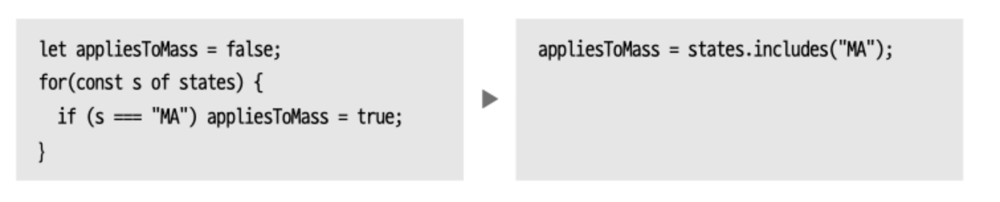

# 기능 이동
요소를 다른 클래스나 모듈 등으로 옮기는 일 역시 리팩토링이다. 
- 함수 옮기기
- 필드 옮기기
- 문장 옮기기
- 반복문 리팩터링 모두가 해당 scope이다.

## 1. 함수 옮기기
좋은 소프트웨어 설계가 되려면 모듈화가 잘 되어 있어야한다. 
이를 위해서는 서로 연관된 요소들을 함께 묶고 연결관계 파악이 쉬워져야 한다. 

함수도 요소이므로, 어느 모듈에 있어야 더 관련성이 있을지 고민해야한다. 그러나 그것을 결정하는 것은 쉽지는 않다.

도움이 되는 방식은 대상 함수의 현재 컨텍스트와 후보 컨텍스트를 둘러보는 것이다. 
예를 들면 대상 함수를 호출하는 함수가 무엇이고, 대상 함수가 호출하는 함수는 무엇이고, 대상함수가 사용하는 데이터는 무엇인지 알아야한다. 

ex. 중첩함수 최상위로 옮기기 (옮기면서 새로운 임시 이름을 분리해주면 좋다.)

## 2. 필드 옮기기
프로그램은 데이터 구조를 어떻게 짰는지에 따라 동작 코드가 단순하고 직관적으로 변한다. 

따라서 가장 적합한 데이터 구조를 알아내는 것이 좋다. 
레코드의 필드를 옮기는 리팩터링 또한 데이터 구조를 잘 짜는 방법이다.
```java
class Customer {
    get plan() { return this._plan;}
    get discountRate() {return this._discountRate;}
}
// change like below codes
class Customer {
    get plan(){ return this._plan;}
    get discountRate() {return this.plan.discountRate;}
}
```

필드를 옮기고 싶다면 제일 먼저 해당 필드를 캡슐화한다. 그 다음 다른 클래스에 해당 필드를 옮기고 테스트한다. 

## 3. 문장을 함수로 옮기기
같은 코드가 추가로 실행되면 반복되는 부분을 피호출 함수로 합친다. 

## 4. 문장을 호출한 곳으로 옮기기
여러 곳에서 사용하던 기능이 일부 호출자에게는 다르게 동작하도록 바뀌어야 한다면, 함수가 어느새 둘 이상의 다른 일을 수행하게 될 수 있다. 그렇다면 개발자는 달라진 동작을 함수에서 꺼내 해당 호출자로 옮겨야한다. 

작은 변경이라면 문장을 호출한 곳으로 옮기면 되지만 호출자와 호출 대상의 경계를 완전히 다시 그어야 할 때도 있다. 

일단 이동하지 않을 코드를 따로 추출해두고, 그 외의 문장을 각 호출자로 옮긴다.

## 5. 인라인 코드를 함수 호출로 바꾸기

여러 동작을 하나로 묶어주므로 유용하다.